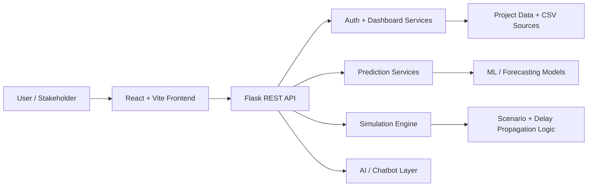

# ASTRA GRID

<div align="center">

[](https://www.python.org/)
[](https://react.dev/)
[](https://vitejs.dev/)
[](https://flask.palletsprojects.com/)
[](https://www.docker.com/)

</div>

ASTRA GRID is an AI-powered power transmission intelligence platform designed to help stakeholders monitor, predict, and optimize large-scale grid infrastructure projects.

It brings together a modern analytics dashboard, predictive modeling, scenario simulation, and an intelligent project assistant to understand risk, cost overruns, schedule delays, permitting bottlenecks, and operational inefficiencies across India's transmission network.

## Why this project matters

India's power transmission ecosystem is large, complex, and highly sensitive to delays, cross-border dependencies, permitting friction, material shortages, and terrain-related challenges. ASTRA GRID turns fragmented project data into a decision-support platform that helps teams:

- assess project health in real time
- estimate hidden risk exposure
- simulate schedule and budget impact
- track delay propagation across interdependent tasks
- answer operational questions with a project-focused AI assistant

## Key capabilities

### Analytics and dashboarding
- Transmission project overview with risk, cost, and timeline metrics
- Multi-dimensional analysis by region, voltage level, project type, and hotspot
- Substation and geographic intelligence using structured datasets
- Executive-style KPI summaries for stakeholder review

### Predictive intelligence
- Cost-overrun and timeline-risk estimation from project characteristics
- Risk scoring based on project conditions and operational constraints
- Decision support for high-impact transmission planning scenarios

### Simulation and scenario planning
- Project scenario modeling for budget and schedule changes
- Delay propagation logic to understand cascading project impact
- What-if analysis for infrastructure and execution planning

### AI project assistant
- Natural language interface for power grid and project queries
- Support for project-related analysis and operational explanation
- Designed as a practical knowledge layer for domain users

## System architecture



## Tech stack

- Frontend: React 19, Vite, Tailwind-style component system
- Backend: Flask, Python, REST APIs
- Data layer: CSV-driven analytics and geospatial project datasets
- AI/ML: scikit-learn, XGBoost, LightGBM, pandas, numpy
- Database-ready: MongoDB-compatible configuration
- Deployment: Docker + Nginx-ready setup

## Project structure

```text
ASTRA_GRID/
├── backend/                  # Flask backend, routes, services, app config
├── frontend/                 # React dashboard and UI components
├── public/                   # Static assets and supporting files
├── package.json              # Frontend scripts and dependencies
├── package-lock.json         # Locked dependency state
├── vite.config.js            # Vite config
├── Dockerfile                # Frontend container setup
├── docker-compose.yml        # Multi-service orchestration
├── nginx.conf               # Reverse proxy configuration
├── Final_dataset.csv         # Core power grid project dataset
├── cable_coordinates.json    # Grid/network coordinate data
├── substation_geocoded_v2.csv # Geocoded substation dataset
├── .env.example              # Example environment variables
├── .env.production.example   # Production config template
├── README.md                 # Portfolio-facing project overview
├── LICENSE                   # License
└── ...
```

## How it works

1. Data is loaded from project and geospatial datasets.
2. The frontend visualizes KPIs, trends, and regional comparisons.
3. The backend exposes services for auth, prediction, simulation, and dashboard metrics.
4. Scenario logic models overruns and cascading delays across project dependencies.
5. The chatbot layer answers power-grid operational questions based on project context.

## Local setup

### 1) Install frontend dependencies

```bash
npm install
npm run dev
```

### 2) Start the backend

```bash
cd backend
python -m venv venv
# Windows
venv\Scripts\activate
# macOS / Linux
# source venv/bin/activate
pip install -r requirements.txt
python run.py
```

### 3) Run with Docker

```bash
docker-compose up --build
```

## Portfolio impact

This project demonstrates:

- product thinking around energy infrastructure analytics
- full-stack application architecture
- AI-integrated business workflows
- data-driven decision tooling
- frontend + backend orchestration in a realistic domain problem

## Notes

This is a clean public-facing version of the application intended for GitHub and portfolio review. The repo has been curated to highlight the actual product value rather than raw internal deployment artifacts.
